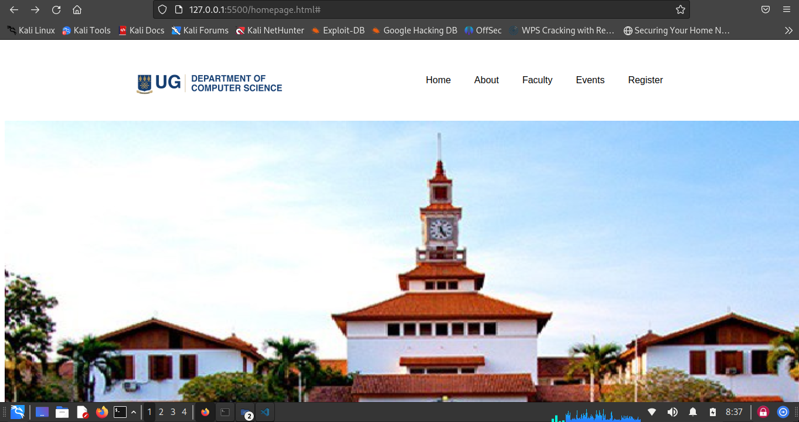
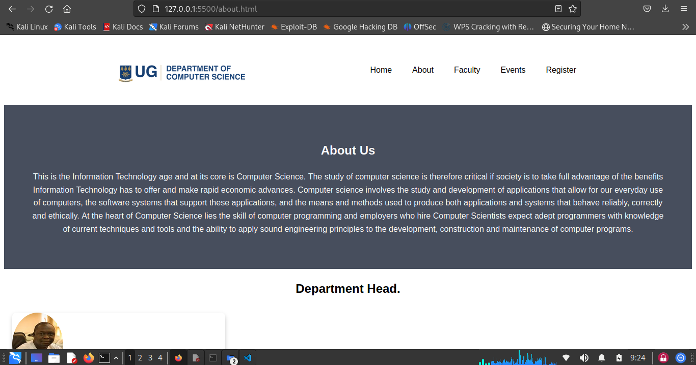
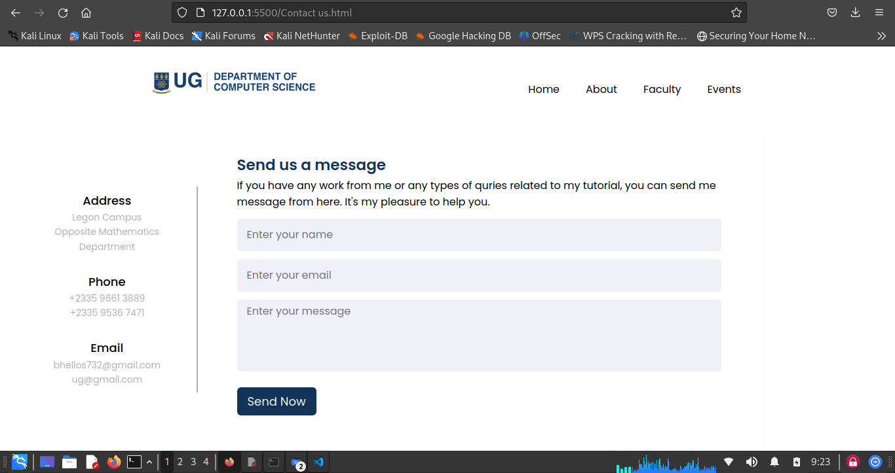
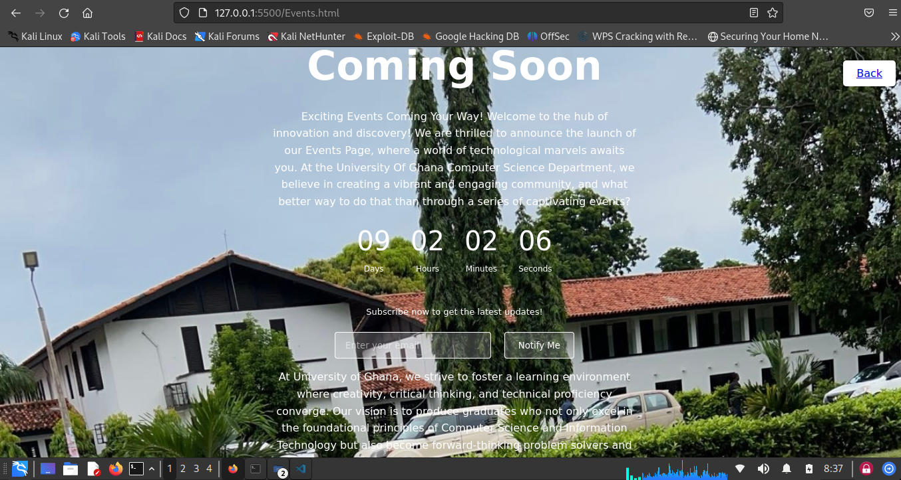

# DCIT_205_IA
# University Computer Science Department Website

This is a website for the computer science department of a university.

## Getting Started

To get started, you can clone this repository to your local machine.
bash
git clone https://github.com/blayonstance/DCIT_205_IA.git

Then open the homepage.html file in your browser.

## Screenshots
<!--DELIMITER-->
Homepage

About Page.

Contact Page.

Events page.

## What I Learned
Through this project I learned:
- How to structure a multi-page website
- Using CSS Grid and Flexbox for layout
- Making responsive navigation menus
- Adding images, cards, sliders etc
- Basics of web access- Using Git version control
- Learned about computer science academic programs
## Author
Name: Bello AbdulSamad
ID: 1115057
- [@blayonstance](https://github.com/blayonstance/)

This code provides a clear and concise explanation of the project. It includes the necessary steps to get started, screenshots of the website, and a list of the skills learned..</s>